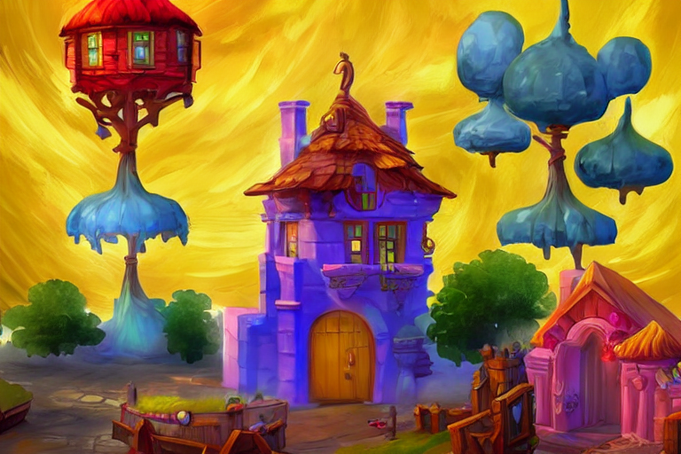

# stadiff-aws

Self-hosted Stable Diffusion using Python Flask on AWS G4 EC2 instance (which is powered by NVIDIA T4 GPUs) provisioned by Terraform.

## Overview

This project includes:

- [app.py](app.py): Flask application serves [Stable Diffusion model](https://github.com/Stability-AI/stablediffusion) from [Diffusers package](https://github.com/huggingface/diffusers).
- [frontend](frontend/): Simple form for users to input the `prompt` which is used to generate image. Developed with HTML, CSS and JS by my friend, [@tduong5522](https://github.com/tduong5522).
- [infra](infra/): Terraform code and some scripts to automatically provisioned AWS G4 instance which has NVIDIA T4 GPUs to run the `app.py`.

## Getting started

### 0. Prerequisite

- Install [Terraform](https://developer.hashicorp.com/terraform/tutorials/aws-get-started/install-cli).
- Create [AWS Access key and Secret key](https://docs.aws.amazon.com/powershell/latest/userguide/pstools-appendix-sign-up.html).

### 1. Configure AWS access key

If you have `aws cli` in your machine, you can run this command:

```bash
aws configure
```

Otherwise, you can configure with environment variable like this:

```bash
export AWS_ACCESS_KEY_ID=XXXXXXXXXXXXXX
export AWS_SECRET_ACCESS_KEY=XXXXXXXXXXXXXXXXXXXXXXXXXXXX
```

### 2. Run all-in-one deployment script

To create the EC2 instance and host the Flask application, you can do like this:

```bash
cd infra
bash helpers.sh deploy
```

After the script finish executing, you can see the URL in the output

```bash
...
null_resource.install-driver: Creation complete after 9m45s [id=8974578201145461998]

Apply complete! Resources: 1 added, 0 changed, 0 destroyed.
Connection to 18.140.56.73 closed by remote host.
Wait for VM to be ready...
Access this URL to try ===>  http://18.140.56.73:5000
```

### 3. Access output URL to start generating image

As the output above, we can access the URL `http://18.140.56.73:5000` to start generating image.

Let's try with the prompt "a bar in a middle of a tropical forest", then adjust the `Height` and `Width` of the image to `808`, then click `Generate`.


### 4. Delete AWS EC2 instance after testing

```bash
cd infra
bash helpers.sh destroy
```

## Main features

### Text-to-Image

Flask endpoint for Text-to-Image generation.

```python
@app.post("/txt2img")
def text_to_img():
    data = request.json
    model_id = "stabilityai/stable-diffusion-2"
    output = "output_txt2img.png"

    scheduler = EulerDiscreteScheduler.from_pretrained(model_id, subfolder="scheduler")
    pipe = StableDiffusionPipeline.from_pretrained(
        model_id, scheduler=scheduler, revision="fp16", torch_dtype=torch.float16
    )
    pipe = pipe.to("cuda")
    image = pipe(data["prompt"], height=data["height"], width=data["width"]).images[0]

    image.save(output)
    return send_file(output), 200
```

Input: *`beautiful shore with white sand with some palm, can see an island far away`*.

Output:


### Image-to-Image

Flask endpoint for Image-to-Image generation with text guided

```python
@app.post("/img2img")
def img_to_img():
    data = request.json
    model_id = "runwayml/stable-diffusion-v1-5"
    output = "output_img2img.png"

    pipe = StableDiffusionImg2ImgPipeline.from_pretrained(
        model_id, torch_dtype=torch.float16
    )
    pipe = pipe.to("cuda")
    response = requests.get(data["url"])
    init_image = Image.open(BytesIO(response.content)).convert("RGB")
    init_image = init_image.resize((768, 512))
    images = pipe(
        prompt=data["prompt"], image=init_image, strength=0.75, guidance_scale=7.5
    ).images

    images[0].save(output)
    return send_file(output), 200
```

Input image:


Input guided prompt: *`A fantasy house, trending on artstation`*.

Output:


