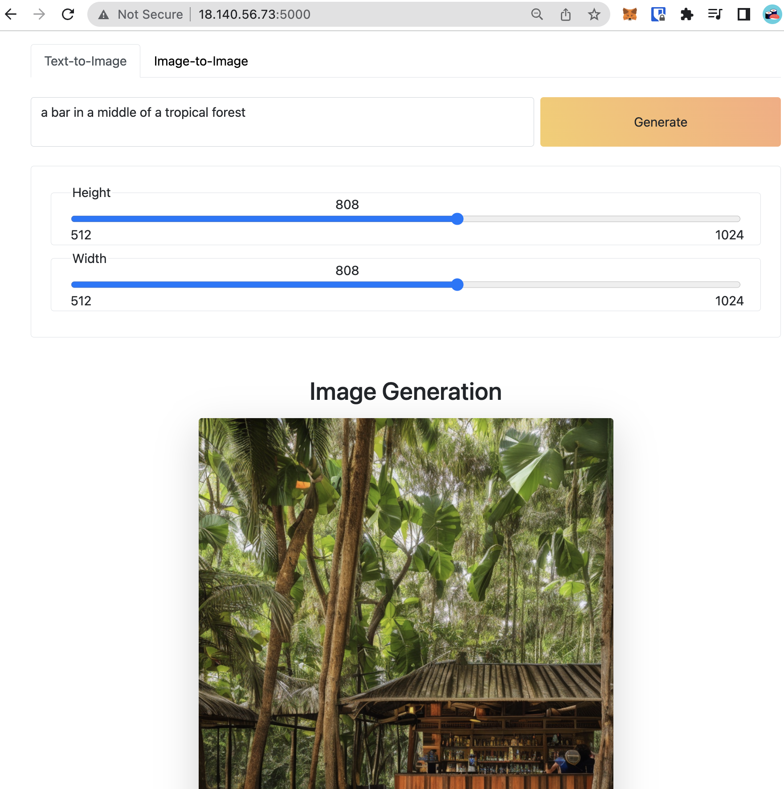

# stadiff-aws

Self-hosted Stable Diffusion using Python Flask on AWS G4 EC2 instance (which is powered by NVIDIA T4 GPUs) provisioned by Terraform

<!-- [X] Add Overview
[ ] Demo main feature text to image
[ ] Demo main feature image to image -->

## Overview

This project includes:

- [app.py](app.py): Flask application serves [Stable Diffusion model](https://github.com/Stability-AI/stablediffusion) from [Diffusers package](https://github.com/huggingface/diffusers).
- [frontend](frontend/): Simple form for users to input the `prompt` which is used to generate image. Developed with HTML, CSS and JS by my friend, [@tduong5522](https://github.com/tduong5522).
- [infra](infra/): Terraform code and some scripts to automatically provisioned AWS G4 instance which has NVIDIA T4 GPUs to run the `app.py`.

## Getting started

### 1. Configure AWS access key

Create AWS access key in this [link](https://docs.aws.amazon.com/powershell/latest/userguide/pstools-appendix-sign-up.html).

Configure your AWS access key and secret key to run Terraform. If you have `aws cli` in your machine, you can run this command:

```bash
aws configure
```

Otherwise, you can configure with environment variable like this:

```bash
export AWS_ACCESS_KEY_ID=XXXXXXXXXXXXXX
export AWS_SECRET_ACCESS_KEY=XXXXXXXXXXXXXXXXXXXXXXXXXXXX
```

### 2. Run all-in-one deployment script

To create the EC2 instance and host the Flask application for using Stable Diffusion, you can do like this:

```bash
cd infra
bash helpers.sh deploy
```

After the script is completed, you can see the url in the output

```bash
...
null_resource.install-driver: Creation complete after 9m45s [id=8974578201145461998]

Apply complete! Resources: 1 added, 0 changed, 0 destroyed.
Connection to 18.140.56.73 closed by remote host.
Wait for VM to be ready...
Access this URL to try ===>  http://18.140.56.73:5000
```

### 3. Access output URL to start generating image

As the output above, we can access the URL `http://18.140.56.73:5000` to start generating image.

Let's try with the prompt "a bar in a middle of a tropical forest", then adjust the `Height` and `Width` of the image to `808`, then click `Generate`.



## Main features

### Text-to-Image

### Image-to-
